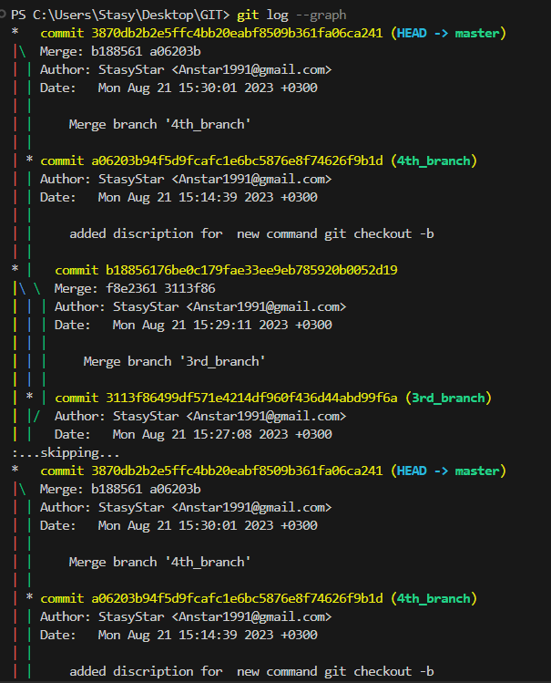

# Инструкция по GIT
## 1. Проверка наличия установленного GIT
В терминале выполняем команду git --version. Если GIT установлен появится информация о версии GITа.

## 2. Настройка GIT.
При первом использовании GIT надо представиться. Для этого в терминале вводим команды: 

* **git config --global user.email "Anstar1991@gmail.com"** - команда для того, чтобы GIT запомнил вашу почту (лучше использовать почту с GitHub)
* **git config --global user.name "StasyStar"** - команда для того чтобы GIT запомнил ваше имя (лучше использовать ник с GitHub)
* **git --version** - команда для просмотра версии GIT на вашем компьютере

## 3. Инициализация репозитория
Для того, чтобы GIT начал отслеживать рабочую папку, нужно сделать ее репозиторием:

* **git init** - команда для отслеживания и работы с текущей папки GITом, делает папку репозиторием
* **git status** - команда чтобы узнать статус документа

## 4. Сохранение изменений в файле
При работе с файлом нужно обязательно сохранять изменения файла, иначе GIT будет выдавать ошибку лучше всего 
настроить автосохранение в File -> Auto Save. А чтобы сохранять новые изменения в GIT нужно обязательно использовать 
команды git add и git commit -m, но для удобства можно воспользоваться единой командой для этих двух git commit -am.

* **git add .\GitInstruction.md** - команда для сохранения изменений, которые были произведены в файле в GITe (его название указывается после слеша)
* **git commit -m "initial commit"** - команда для фиксации всех изменений, а так же для подписи комментария к проделанным изменениям
* **git commit -am "initial commit"** - команда, которая выполняет 2 команды вместе "git add" + "git commit -m"

## 5. Перемещение между сохранениями
Для просмотра всех сделанных изменений и для выбора какой-то опереденной версии файла пользуемся командами из блока ниже:

* **git log** - команда для проверки всех изменений, которые были сделаны в файле
* **git diff** - команда для просмотра сделанных изменений
* **git checkout 38f4** - команда для возврата к какой-то определенной версии файла (достаточно прописать первые четыре символа ее названия)
* **git checkout master** - команда для перехода к последней версии файла

## 6. Добавление картинок и игнорирование файлов
Чтобы добавить картинку в файл нужно скачать ее и добавить в папку репозитория. Чтобы добавить эту картинку нужно прописать следующую команду:

```

```

Так как Git видит все файлы в репозитории, то мы можем сделать этот файл игнорируемым, чтобы он не числился как недобавленный к отслеживанию файл. Для этого мы создаем новый файл с названием 

* **.gitignore** 

и туда добавляем название нужного файла с расширением. Либо добавляем конкретные расширения (*.jpeg *.png). После этого не забываем добавить файл .gitignore к отслеживанию с помощью команды git add .gitignore.

## 7. Ветвление
Ветвление используется для того, чтобы над проектом могли работать несколько разработчиков каждый на своей ветке или для того, чтобы можно было делать какие-то доработки. После тестирования доработок все косвенные ветки сливаются в главную (по умолчанию она называется master/main). Чтобы работать с ветвлениями используются следующие команды:

* **git branch** - команда для просмотра всех веток, так же показывает на какой ветке сейчас находимся
* **git branch branch_name** - команда для создания новой ветки с написанием названия этой ветки
* **git branch -m new_branch_name** - команда для переименования ветки в которой на данный момент находитесь
* **git checkout branch_name** - команда для перехода на ветку с соответствующим названием
* **git checkout -b branch_name** - команда для создания и перехода на ветку с название branch_name


## 8. Слияние веток
После того как все доработки в ветке закончены и протестированы ее можно слить с главной веткой. Для этого нужно зайти в главную ветку master/main или в ту ветку куда следует добавить новые изменения и выполнить следующую команду с названием ветки, из которой мы будем брать изменения:

* **git merge branch_name**



## 9. Разрешение конфликта
Конфликты возникают когда в двух ветках ведется работа над одним и тем же блоком/строкой кода. При слиянии таких веток возникает конфликт в котором есть несколько путей его разрешения:

* **Accept Current Change** - остаются изменения ветки в которой находитесь, остальные удаляются
* **Accept Incoming Change** - остаются изменения ветки из которой берутся данные для слияния
* **Accept Both Changes** - остаются оба изменения
* **Compare Changes** - сравнение двух изменений


## 10. Работа с удаленным репозиторием
Для совместной работы используются удаленные репозитории. Чаще всего каждый программист клонирует себе готовый 
проект, создает в нем отдельную ветку, в которой ведет свои разработки. После того как все работы закончены 
программист делает Pull Request, а ответственный человек проверяет изменения и уже сливает их в главную ветку 
master/main. Шаги для для создания Pull Request:
1. Создаем и инициализируем новый репозиторий 
   * git init
2. Делаем fork нужного проекта в свой удаленный репозиторий
3. Клонируем проект из удаленного репозитория 
   * git clone https://github.com/StasyStar/gb_lesson.git
4. Переходим в папку клонированного репозитория 
   * cd gb_lesson
5. Создаем новую ветку и переходим на нее
   * git branch "stasyBranch" and git checkout “stasyBranch”
   * git checkout -b “stasyBranch”
6. Добавляем все изменения и файлы для отслеживания
   * git add .
7. Делаем коммит на изменения
   * git commit -m “hwSeminar3”
8. Привязываем удаленный репозиторий к локальному, если это еще не было сделано
   * git remote add origin https://github.com/StasyStar/gb_lesson.git
9. Отправляем данные на удаленный репозиторий 
   * git push --set-upstream origin “stasyBranch”
10. После этого переходим на страницу удаленного репозитория и нажимаем "Compare & Pull Request"