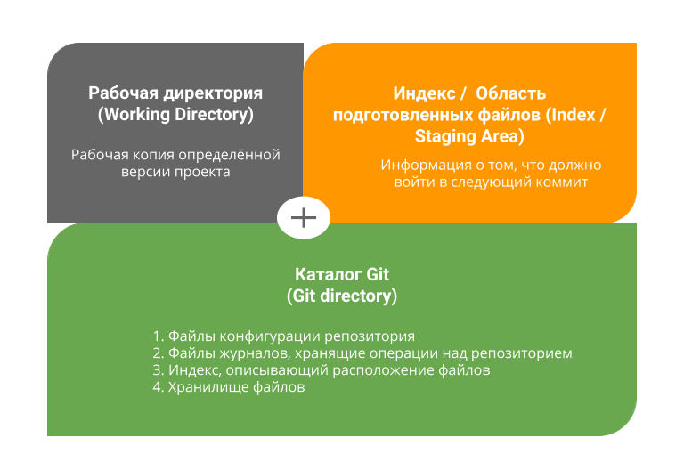
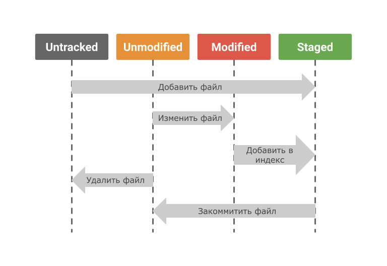

# Инструкция по работе с Git


## Git. Определение, история и внутренняя реализация

### Что такое Git?
**Git** — это система контроля версий, которая помогает отслеживать историю изменений в файлах и используются программистами для совместной работы над проектами.

К базовым возможностям Git относятся:
* возврат к любой предыдущей версии кода;
* просмотр истории изменений;
* параллельная работа над проектом;
* backup кода.

### История появления Git
Git был разработан командой **Линуса Торвальдса** в 2005 году, как **open-source** аналог уже существующим системам. Но разработка Git не была спонтанным решением. Дело в том, что с самого первого релиза в 1991 году разработка ядра **Linux** выполнялась по старинке: старая версия архивировалась, а новые патчи от разработчиков становились новой версией.

Но с ростом популярности рос и объем данных, поэтому в 2002 году было принято решение перевести ядро **Linux** на распределенную систему управления версиями **BitKeeper** от **BitMover Inc.** Однако между компаниями произошел разлад и **BitMover Inc.** отозвали лицензию на бесплатное использование своего ПО.

Этот инцидент и подстегнул Линуса Торвальдса с командой разработчиков создать свою открытую распределенную систему контроля версий.

Основные **требования** к новой системе были следующими:
1. Скорость;
2. Простота дизайна;
3. Поддержка нелинейной разработки (тысячи параллельных веток);
4. Полная распределенность;
5. Возможность эффективной работы с такими большими проектами, как ядро **Linux** (как по скорости, так и по размеру данных).

Разработка новой системы контроля версий началась 3 апреля 2005 года, а первая версия Git была готова к 7 апрелю того же года.

### Основные понятия
1. **Репозиторий** – папка проекта, отслеживаемого Git, содержащая дерево изменений проекта в хронологическом порядке. Все файлы истории хранятся в специальной папке `.git/` внутри папки проекта.

2. **Индекс** – файл, в котором содержатся изменения, подготовленные для добавления в коммит. Вы можете добавлять и убирать файлы из индекса.

3. **Коммит** – фиксация изменений, внесенных в индекс. Другими словами, коммит – это единица изменений в вашем проекте. Коммит хранит измененные файлы, имя автора коммита и время, в которое был сделан коммит. Кроме того, каждый коммит имеет уникальный идентификатор, который позволяет в любое время к нему откатиться.

4. **Указатели HEAD, ORIGHEAD** и т. д. – это ссылка на определенный коммит. Ссылка – это некоторая метка, которую использует Git или сам пользователь, чтобы указать на коммит.

5. **Ветка** – это последовательность коммитов. Технически же, ветка – это ссылка на последний коммит в этой ветке. Преимущество веток в их независимости. Вы можете вносить изменения в файлы на одной ветке, например, пробовать новую функцию, и они никак не скажутся на файлах в другой ветке. Изначально в репозитории одна ветка.

6. **Рабочая копия**. Директория `.git/` с её содержимым относится к Git. Все остальные файлы называются рабочей копией и принадлежат пользователю.

### Состояния файлов в Git репозитории
Репозиторий Git условно можно разделить на три составляющие:
1. **Рабочая директория - Working directory**. Это файловая структура, с которой непосредственно работает пользователь в конкретный момент времени. Технически же – это копия определенной версии вашего проекта, которую вы извлекли из базы Git и в которую пытаетесь внести свои изменения.

2. **Индекс или Область подготовленных файлов - Index / Staging area**. Это область, где хранятся имена файлов и изменения в них, которые должны войти в следующий коммит. Технически индекс – это просто файл.

3. **Директория Git - Git Directory**. Папка, в которой Git хранит все версии вашего проекта и также свои служебные файлы. Данная папка носит название `.git` и располагается в корневой директории вашего проекта.



Каждый файл может находится только в одном из двух состояний:
1. **Отслеживаемый**. Об этих файлах Git знает и отслеживает изменения в них. Отслеживаемые файлы в свою очередь могут находится в следующих состояниях:
    * **Неизмененный**. То есть с момента последнего коммита в файле не было никаких изменений;
    * **Измененный**. То есть с последнего коммита в файле были произведены какие-то изменения;
    * **Подготовленный к коммиту**. Это значит, что вы внесли изменения в этот файл и затем проиндексировали их, и эти изменения будут добавлены в следующий коммит.
2. **Неотслеживаемый**. О неотслеживаемых файлах Git не знает, поэтому изменения в них не будут добавлены в коммит. Это любые файлы в вашем рабочем каталоге, которые не входили в последний коммит и не подготовлены к текущему коммиту.



### Внутреннее устройство Git
Всю информацию Git представляет в виде "объектов". **Объект** – это файл, содержащий определенную информацию о репозитории и его файлах. Все объекты хранятся в директории `.git/objects/`. Объекты бывают трех типов:
1. **Blob** (англ. **binary large object**) – большой бинарный объект, другими словами просто бинарный файл. Для каждого файла в репозитории формируется **blob-файл**, который содержит его имя и сжатое содержимое. **Blob-файл** формируется, когда мы добавляем файл в индекс.

2. **Tree** (англ. **tree** – дерево). **Дерево** – это такой тип графа. Оно нужно нам, чтобы показывать связи между файлами в репозитории. Деревья формируются для каждой директории репозитория (в том числе для корневой) во время коммита и показывают, какие файлы (или поддиректории) лежат в данной директории. Таким образом, объект дерева состоит из имен 1) **blob-объектов** для файлов, которые лежат в данной директории, и 2) других деревьев для всех поддиректорий.

3. **Объект коммита**. Этот объект содержит в себе имя автора коммита, время коммита и объект дерева корневой директории проекта.

Кроме этих трех объектов, важным во внутреннем устройстве Git является файл индекса.

**Индекс** – файл, в котором содержатся изменения, подготовленные для добавления в коммит. 

## Создание изменений: индексация и коммиты. Команды: init, status, add, commit, log, diff

### Начало работы. Установка имени и электронной почты
Если вы никогда ранее не использовали Git, для начала вам необходимо осуществить установку. Выполните следующие команды, чтобы Git узнал ваше имя и электронную почту. Эти данные используются для подписи изменений сделанных вами, что позволит отслеживать, кто и когда сделал изменения в файле.
```
git config --global user.name "имя"
git config --global user.email "электронная_почта"
```
### Создание репозитория. Команда git init
Для создания нового репозитория используется команда `git init`. Команду `git init` выполняют только один раз для первоначальной настройки нового репозитория. Выполнение команды приведет к созданию нового подкаталога `.git` в вашем рабочем каталоге. Кроме того, будет создана новая главная ветка.

### Состояния файлов в Git репозитории. Команда git status
Узнать о состоянии файлов в Git можно с помощью команды `git status`, которая отображает состояние рабочего каталога и раздела проиндексированных файлов. Она показывает, какие неотслеживаемые файлы попали в проект, какие файлы находятся в индексе и какие сохранённые файлы вы изменили в репозитории.

### Делаем файлы отслеживаемыми. Команда git add
Чтобы сделать файлы отслеживаемыми, необходимо использовать команду `git add`, которая добавляет изменение из рабочего каталога в раздел проиндексированных файлов. Она сообщает Git, что вы хотите включить изменения в конкретном файле в следующий коммит. 
```
git add <имя файла>
```

### Делаем коммит. Команда git commit
Для создания коммита используется команда `git commit`, которая делает для проекта снимок текущего состояния изменений, добавленных в раздел проиндексированных файлов. Такие подтвержденные снимки состояния можно рассматривать как «безопасные» версии проекта — Git не будет их менять, пока его явным образом не попросить об этом.

**Варианты команды git commit**:
```
git commit
```
Коммит проиндексированного состояния кода. Эта команда откроет текстовый редактор с предложением ввести комментарий к коммиту.
```
git commit -a
```
Выполнение коммита состояния со всеми изменениями в рабочем каталоге. Эта команда включает только изменения отслеживаемых файлов (тех, которые были в какой-то момент добавлены в историю с помощью команды `git add`).
```
git commit -m "commit message"
```
Быстрая команда, которая создает коммит с указанным комментарием.
```
git commit -am "commit message"
```
Команда с параметрами `-a` и `-m`, которая создает коммит всех проиндексированных изменений и добавляет к коммиту подставленный комментарий.

### Просмотр журнала коммитов. Команда git log
Просмотр журнала коммитов осуществляется с помощью команды `git log`, которая перечисляет коммиты, сделанные в репозитории в обратном к хронологическому порядке — последние коммиты находятся вверху. Команда `git log` позволяет посмотреть хеш, сообщение, дату и ник автора коммита. Команда `git log --oneline` выводит информацию о каждом коммите в одну строку.

### Просмотр различий между коммитами. Команда git diff
Бывает необходимо просмотреть различия между двумя коммитами. Так можно понять, какие конкретно изменения были внесены вместе с данным коммитом. Для реализации такой возможности в Git существует команда `git diff` которой можно передать ссылки на коммиты для сравнения.

Команда `git diff` также показывает разницу между последним коммитом и текущим состоянием репозитория. То есть последний коммит сравнивается со всеми неотслеживаемыми файлами, которые ещё не переведены в индекс.

## Ветвление: создание и удаление веток, переключение между ними, слияние изменений. Команды: branch, checkout, merge, remove

### Зачем нужны ветки?
Чаще всего ветки используются в следующих случаях.
1. Ветки нужны, чтобы несколько программистов могли **вести работу** над одним и тем же проектом или даже файлом **одновременно**, при этом не мешая друг другу.

2. Кроме того, ветки используются **для тестирования экспериментальных функций**: чтобы не повредить основному проекту, создается новая ветка специально для экспериментов. Если эксперимент удался, изменения с экспериментальной ветки переносятся на основную, если нет – новая ветка попросту удаляется, а проект остается нетронутым.

3. Помимо прочего, ветки можно использовать **для разных выходящих параллельно релизов** одного проекта.

### Создание новых веток
После первого коммита Git автоматически создаёт первую ветку. Обычно в ней хранят стабильную версию проекта для пользователей продукта. Под остальные задачи создаются отдельные ветки с помощью команды `git branch`.
```
git branch <имя ветки>
```

### Просмотр списка веток
Команда `git branch` позволяет получить список всех доступных веток в проекте. Также она проставляет символ звёздочки слева от текущей активной ветки.

### Переключение между ветками
Если нужно переключиться на другую ветку, нужна команда `git checkout <имя ветки>`, которая производит несколько действий:
1. Программа проверяет, существует ли указанная ветка;

2. Затем программа переключает указатель **HEAD** на новую ветку;

3. Последним шагом программа меняет рабочую копию так, чтобы она соответствовала новой ветке.

### Слияние веток
Чтобы выполнить мердж (от англ. merge – слияние), в Git предусмотрена команда `git merge`, которая позволяет добавить изменения из одной ветки в другую. Этот процесс завершается появлением общего коммита для объединённых веток.

Очень часто во время слияния веток оказывается, что изменения удаляют или переписывают информацию в уже существующих файлах. Такая ситуация называется **файловым конфликтом**. Git останавливает выполнение слияния, пока вы не разрешите конфликт, выбрав один из двух файлов.

### Удаление веток
После слияния второстепенная ветка больше не нужна и мы её можем удалить с помощью команды `git branch -d <имя ветки>`. С ключем `-d` ветка будет удалена только в том случае, если она полностью слита с одной из других веток. В противном случае, Git выдаст предупреждение, о том, что в ветке есть неслитые изменения, и не даст ее удалить.

## Работа с удаленным репозиторием. GitHub. Команды: clone, remote add, remote remove, push, pull

### Что такое удаленный репозиторий?
**Удаленный (иногда говорят "внешний") репозиторий** – это версии вашего проекта, сохраненные на удаленном сервере. Доступ к репозиторию на таком сервере может осуществляться по интернету или по локальной сети.

Удаленный репозиторий – полноценный репозиторий, ничем не отличающийся от локального. У удаленного репозитория есть собственные ветки, собственный указатель **HEAD**, своя история коммитов и так далее.

Если мы подключим удаленный репозиторий к своему локальному, то у нас появятся копии всех ссылочных объектов удаленного репозитория. То есть, например, у удаленного репозитория есть ветка **main**, а у нас будет копия этой ветки – **origin/main**.

### Что такое GitHub?
**GitHub** — это сервис для совместной разработки и хостинга проектов.
С помощью GitHub над кодом проекта может работать неограниченное количество программистов из любых точек мира.

В GitHub есть система контроля (управления) версий Git: сервис позволяет просматривать и контролировать любые изменения кода любым разработчиком и возвращаться к состоянию до изменений.

В целом GitHub — это социальная сеть для разработчиков, в которой можно:
* найти проекты с открытым кодом от других разработчиков; 
* практиковаться в написании кода; 
* хранить своё портфолио.

### Клонирование удаленного репозитория. Команда git clone
Операция клонирования создаёт на вашем компьютере точную копию удаленного репозитория.

Необходимость клонировать существующий удаленный репозиторий возникает в ситуациях, когда вы решаете поработать над уже существующим кодом. Для выполнения этой операции в Git предусмотрена команда `git clone`.
```
git clone <ссылка на удаленный репозиторий>
```
Ссылку на удаленный репозиторий можно получить нажав на зеленую кнопку **Code** на главной странице репозитория на GitHub.

### Добавление удаленного репозитория к существующему локальному. Команда git remote add
Необходимость подключить удаленный репозиторий к уже существующему локальному возникает в ситуациях, когда вы решаете выгрузить уже написанный код на удаленный сервер. Это нужно, чтобы другие разработчики смогли получить к нему доступ или чтобы вы сами могли заниматься разработкой с нескольких компьютеров (например, домашнего и рабочего).

Для добавления удаленного репозитория к локальному в Git есть команда `git remote add`.
```
git remote add <название удаленного репозитория> <ссылка на удаленный репозиторий>
```
Имя удаленного репозитория в команде `git remote add` вы можете придумать сами. Принято называть удаленный репозиторий *origin*.

Ссылку на удаленный репозиторий можно взять, нажав на большую зеленую кнопку **Code** на странице репозитория на GitHub.

### Отключение удаленного репозитория от локального. Команда git remote remove
Иногда возникает необходимость забыть удаленный репозиторий. Для этого существует команда `git remote remove`.
```
git remote remove <название удаленного репозитория>
```
В качестве имени репозитория нужно передавать то имя, которое вы указывали в команде `git remote add`. Заметьте, данная команда не удаляет удаленный репозиторий с сервера, она удаляет только подключение вашего репозитория к удаленному.

### Отправка изменений в удалённый репозиторий. Команда git push
Для отправки изменений в удалённый репозиторий используется команда `git push`. Во время первой загрузки нужно использовать команду с опцией `-u`. Это свяжет локальную и удалённую ветки и синхронизирует их для последующих операций. Для второй и всех последующих загрузок опция `-u` для связанных веток не понадобится.

Команда для первой загрузки изменений в удалённый репозиторий: текущая ветка будет связана с веткой main в удалённом репозитории origin
```
git push -u origin main
```
Команда для второй и последующих загрузок изменений в удалённый репозиторий
```
git push
```

### Получение изменений из удалённого репозитория. Команда git pull
Для скачивания изменений из удалённого репозитория в локальный используется команда `git pull`.

### Выполнение Pull Request
**Pull Request** — это запрос на вливание изменений из вашей ветки в основную ветку исходного репозитория. Таким образом они попадут к создателям проекта.

Последовательность действий направления pull request:
1. Создайте **fork** понравившегося репозитория на GitHub;

2. Склонируйте репозиторий;
3. Создайте ветку для своей работы;
4. Сделайте необходимые изменения и зафиксируйте их;
5. Направьте свою версию на собственный GitHub-аккаунт;
6. На сайте GitHub нажмите на появившуюся кнопку **pull request**.

## Приложение. Команды Git
|**Команда**|**Что делает**|
|:-----|:-----|
|git --version|показывает номер версии Git|
|git config --global user.name “name”|устанавливает значение имени в конфигурации Git|
|git config --global user.email “email”|устанавливает значение электронной почты в конфигурации Git|
|git config --list|показывает список конфигураций Git|
|git init|создает пустой репозиторий в директории, откуда была вызвана|
|git status|выводит информацию о статусе файлов, находящихся в репозитории|
|git add file_name|добавляет указанные файлы в индекс|
|git rm --cached file_name|удаляет файл из индекса и оставляет в папке на компьютере|
|git rm file_name|удаляет файл из индекса и рабочей директории|
|git commit|фиксирует добавленные в индекс изменения|
|git commit -a|добавляет файл в индекс и фиксирует изменения |
|git commit -m "commit message"|фиксирует добавленные в индекс изменения с сообщением|
|git commit -am "commit message"|добавляет файл в индекс и фиксирует изменения с сообщением|
|git log|выводит историю коммитов|
|git log --oneline|выводит историю коммитов в одну строку|
|git log --graph|выводит список коммитов в виде дерева|
|git reflog|выводит историю действий|
|git reset --soft commit_hash|откатывает проект к указанному коммиту и переводит все последующие коммиты в индекс|
|git reset --mixed commit_hash|откатывает проект к указанному коммиту и переводит последующие коммиты в неотслеживаемую зону|
|git reset --hard commit_hash|откатывает проект к указанному коммиту и удаляет все последующие коммиты без возможности их восстановления|
|git revert commit_hash|отменяет изменения, внесенные в переданном коммите|
|git restore file_name|восстанавливает указанный файл из переданного источника|
|git checkout commit_hash|переключает пользователя на нужную версию проекта или коммит по его хешу|
|git checkout branch_name|переключает пользователя на другую ветку|
|git checkout main_branch|переключает пользователя на основную ветку|
|git diff|показывает разницу между последним коммитом и текущим состоянием репозитория|
|git diff file_name|показывает разницу между последним коммитом и текущим состоянием файла|
|git diff commit_hash|показывает разницу между последним коммитом и коммитом с указанным хешем|
|git branch|выводит список локальных веток|
|git branch branch_name|создает новую ветку|
|git branch -d branch_name|удаляет указанную ветку|
|git merge branch_name|сливает изменения с переданной ветки в текущую|
|git remote add origin url|привязывает локальный репозиторий к удалённому на GitHub|
|git remote remove origin|отключает удаленный репозиторий от локального|
|git remote|показывает названия удалённых репозиториев, которые связаны с локальным|
|git remote -v|показывает названия удалённых репозиториев с URL-адресами|
|git clone url|клонирует переданный репозиторий на компьютер|
|git push -u origin main|связывает локальную и удалённую ветки и синхронизирует их для последующих операций загрузки изменений из локального репозитория в удалённый|
|git push|отправляет изменения в удалённый репозиторий|
|git pull|скачивает изменения из удалённого репозитория и добавляет их в локальную ветку|

